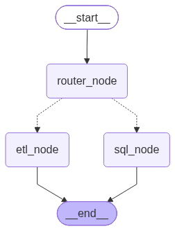
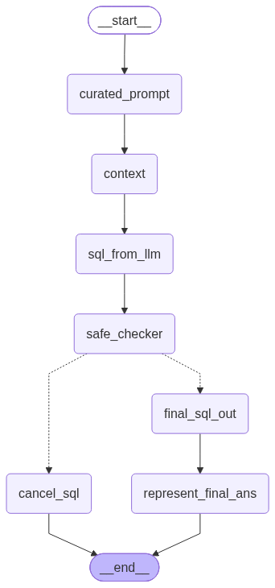

# Data Agent

A multi-agent system that answers natural-language questions about a ride-hailing
database and runs ETL jobs against external APIs — built with LangGraph, LangChain
and Streamlit.

Ask *"how many rides were cancelled last month?"* and it routes the question to a SQL
agent that inspects the live database schema, writes Postgres SQL, has that SQL
reviewed by a separate guardrail model, executes it, and explains the result in plain
English. Ask it to *"pull data from this API and save it as CSV"* and a different
agent picks up the job instead.

**Live demo:** https://data-agent-vpit.onrender.com
*(hosted on a free tier — the first load may take a moment while the service wakes)*

---

## Contents

- [How it works](#how-it-works)
- [Features](#features)
- [Tech stack](#tech-stack)
- [Project structure](#project-structure)
- [Getting started](#getting-started)
- [Running with Docker](#running-with-docker)
- [Tests](#tests)
- [Design notes](#design-notes)
- [Limitations](#limitations)

---

## How it works

A router agent classifies the question and hands it to one of two specialist agents.



### SQL agent



| Node | What it does |
| --- | --- |
| `curated_prompt` | Rewrites the question into something a SQL generator can work with |
| `context` | Reads the live schema from Postgres — tables, columns, types, sample rows |
| `sql_from_llm` | Generates a Postgres query from the question plus that schema |
| `safe_checker` | A **separate** model judges whether the SQL is read-only |
| `final_sql_out` | Executes the query, but only if the judge approved it |
| `cancel_sql` | Refuses the query and explains why, when the judge did not |
| `represent_final_ans` | Turns the result rows into a plain-English answer |

The guardrail is the important part: the model that writes the SQL is never the model
that approves it, and the graph physically cannot reach `final_sql_out` without a
`"Yes"` verdict. If every provider is down, the verdict defaults to `"No"` — it fails
closed rather than running an unreviewed query.

### ETL agent


A tool-calling loop with two tools:

- `extract_load_tool` — fetches JSON from an API endpoint and writes it out as CSV,
  JSON or Parquet.
- `transform_load` — reads a file, shows the model the first few rows as context, asks
  it for pandas code to perform the requested transform, then executes that code.

The loop runs until the model answers in prose instead of calling a tool.

---

## Features

- **Question routing** — one entry point, two specialist agents, chosen by a
  structured-output classifier.
- **Schema-aware SQL** — the generator sees real table names, column types and sample
  rows, so it does not invent columns.
- **A read-only guardrail** — an independent LLM judge blocks `INSERT`, `UPDATE`,
  `DELETE`, `DROP` and friends before anything touches the database, and explains its
  refusal to the user.
- **Multi-provider fallback** — LLM calls try Groq, then Mistral, then Gemini. Free
  tiers rate-limit constantly; losing one provider degrades the answer instead of
  ending the run.
- **Streaming UI** — the Streamlit page reports each graph node as it completes, so a
  slow answer shows progress instead of looking frozen.
- **Two front ends** — a Streamlit chat app and a command-line interface over the same
  compiled graph.

---

## Tech stack

| Layer | Choice |
| --- | --- |
| Orchestration | LangGraph (`StateGraph`, conditional edges, tool nodes) |
| LLM interface | LangChain, with Pydantic schemas for structured output |
| Models | `openai/gpt-oss-120b` (Groq), `mistral-small-latest`, `gemini-3.8-flash` |
| Database | PostgreSQL via `psycopg2` (Neon in production) |
| Data handling | pandas |
| UI | Streamlit |
| Packaging | uv, Docker |
| Tests | pytest |

---

## Project structure

```
agents/
  data_agent.py     router graph - picks the sql or etl agent
  sql_agent.py      the 7-node sql graph, including the guardrail
  etl_agent.py      tool-calling etl loop
utils/
  llm_pick.py       returns a chat model per difficulty level
  database.py       postgres connection, schema inspection, query execution
  etl_tools.py      extract, transform and load helpers
model/
  schema.py         pydantic state schemas for every graph
ui/
  app.py            streamlit chat interface
tests/              pytest suite
data/               source csvs
feed_db.py          creates the tables and loads the csvs
main.py             command-line interface
```

---

## Getting started

### Prerequisites

- Python 3.12+
- [uv](https://docs.astral.sh/uv/)
- A PostgreSQL database ([Neon](https://neon.tech) has a free tier)
- API keys for Groq, Mistral and Google Gemini (all have free tiers)

### 1. Install

```bash
git clone https://github.com/ArChIt690/Data_Agent.git
cd Data_Agent
uv sync
```

### 2. Configure

Create a `.env` file in the project root:

```env
GROQ_API_KEY=your_groq_key
MISTRAL_API_KEY=your_mistral_key
GEMINI_API_KEY=your_gemini_key

host=your-db-host
port=5432
user=your_db_user
password=your_db_password
dbname=your_db_name
database=your_db_name
```

No quotes around the values.

### 3. Seed the database

```bash
uv run python feed_db.py
```

This creates five tables and loads the sample data:

| Table | Rows |
| --- | --- |
| users | 10,000 |
| vehicles | 3,000 |
| rides | 20,000 |
| payments | 16,073 |
| ratings | 12,000 |

### 4. Run it

```bash
uv run streamlit run ui/app.py         # web UI at localhost:8501
uv run python main.py                  # interactive CLI
uv run python main.py "your question"  # one-shot CLI
```

---

## Running with Docker

```bash
docker build -t data-agent .
docker run -p 8501:8501 --env-file .env data-agent
```

If your database runs on the host machine rather than in the cloud, `localhost` inside
the container refers to the container itself — point it at the host instead:

```bash
docker run -p 8501:8501 --env-file .env \
  -e host=host.docker.internal --add-host=host.docker.internal:host-gateway \
  data-agent
```

---

## Tests

```bash
uv run pytest
```

30 tests covering the Pydantic state schemas, the model picker, the ETL file tools,
the three routing functions that decide the graph's next edge, and Streamlit smoke
tests via `AppTest`.

No test makes a network call or touches the database — `tests/conftest.py` supplies
dummy API keys, so the suite runs on a clean checkout with no secrets configured.

---

## Design notes

A few decisions that are not obvious from the code alone.

**The guardrail fails closed.** If every provider is unavailable, `safe_checker`
records `"No"` and the graph routes to `cancel_sql`. Refusing to answer is the correct
failure mode for something that runs generated SQL.

**Provider order is measured, not guessed.** The judge asks Groq for JSON output
rather than tool calls — Groq's model tends to answer in prose when given tools, which
returns a `400 tool_use_failed`. Each fallback list is ordered by which provider is
actually fastest and most reliable in practice, not by which is nominally strongest.

**The graph streams instead of blocking.** Free-tier models can take a while, so both
front ends consume `graph.stream()` and report each node as it finishes rather than
waiting silently on `invoke()`.

**Nodes return only what changed.** LangGraph's `messages` field uses an `add` reducer,
so returning the whole list appends it to itself and the history grows geometrically.
Every node returns just the new message.

**Database errors surface to the user.** A failed connection raises rather than being
swallowed, so a misconfigured host shows up as the real `OperationalError` instead of
an `AttributeError` three frames later.

---

## Limitations

Worth being upfront about:

- **The router has no fallback.** Every question passes through a single Groq call. If
  Groq is unavailable, the run fails before either agent is reached — unlike the SQL
  agent's nodes, which try three providers each.
- **`transform_load` executes generated code.** The ETL tool runs LLM-written pandas
  via `exec()`. That is fine for a controlled demo and unacceptable for anything
  handling untrusted input.
- **Free-tier rate limits are the main source of latency.** A typical question takes
  about 7 seconds when providers are healthy, and considerably longer when one is
  timing out on the way to the fallback.
- **Streamlit session state is per-instance.** Running more than one replica would
  break the chat history, so the deployment is pinned to a single instance.
